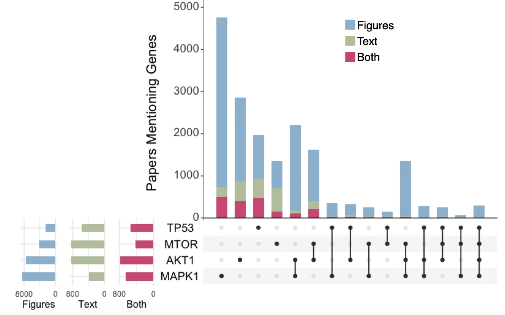

Pathway Figure OCR is an open science project dedicated to extracting pathway information from the published literature to be freely used by anyone.
Thousands of pathway diagrams are published each year as static figures inaccessible to computational queries and analyses. Using a combination of machine learning, optical character recognition, and manual curation, we identified pathway figures published between 1995 and 2021 and extracted human genes, from a wide variety of biological processes. Many of the genes included in figures are not found in the article text (see Upset plot below). 
 This collection represents an order of magnitude more genes than found in the text of the same papers, and thousands of genes missing from other pathway databases, thus presenting new opportunities for discovery and research.

