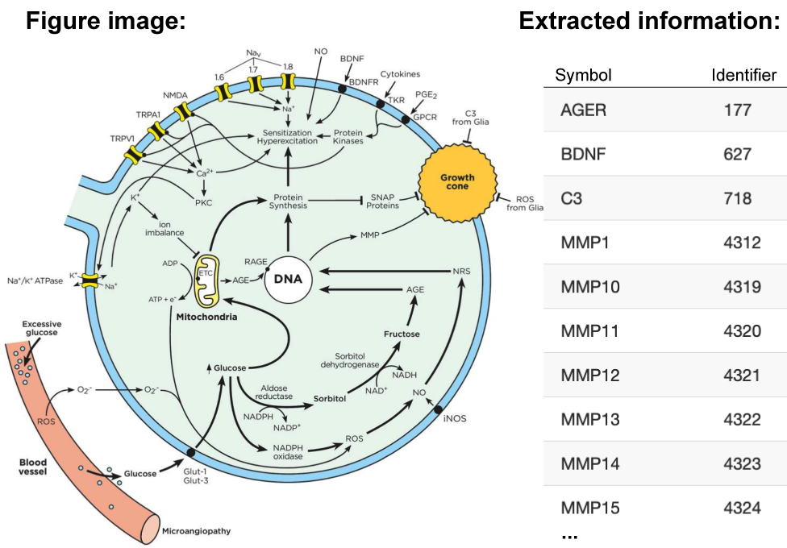

  
<section id="intro"> 
  <main class="home-page-content" aria-label="Content">
    
   
      

        

          

            

              

                <h2 style="font-family:Poppins; line-height:1.4"><b>Pathway Figure OCR</b> is an open science project dedicated to extracting pathway information from the published literature to be freely used by anyone.
                </h2>
                <a class="btn btn-sm btn-front my-1" href="/about.html">Read more</a>
                <a class="btn btn-sm btn-front my-1" href="https://youtu.be/8XRS_dTX-eM" target="_blank">Video tour</a>
                  
                

                  
 
                    

                      <h3 style="font-family:Poppins; text-align: left; font-size:larger; padding-left:32px;"><b>Search published figures</b>
                      </h3>
                      

                        <form id="searchForm2" action="/search.html">
                        <i class="fa fa-search" aria-hidden="true"></i>
                        <input type="text" name="searchQuery2" placeholder="&nbsp;e.g., ace2 aldosterone human" style="width: 280px;">
                        </form>          
                      

                      
                      
Search by gene symbols, pathway names or other keywords

                    

                  

                

              

            

          

          

            

              
              
Pathway figures annotated with genes, metabolites, drugs and disease identifiers.

            

          
 
        

      

    

  </main>
</section>

<section id="join">
    
   
      

        

          

            

              

                <h1 style="font-family:Linux Libertine; ">Dedicated to open access</h1><h2 style="font-family:Poppins; color: #6c757d;line-height:1.4"> Almost a thousand pathway figures are published each month. We are releasing the information trapped in inaccessible PDFs and images for researchers globally.</h2>
              

            

          

          

            

              

              
              

            

          

        

      

    

</section>
<section id="browse">
    
   
      

        

          

            

              

              

  <ol class="carousel-indicators" style="margin-bottom: -25px;">
    <li data-target="#carouselBrowse" data-slide-to="0" class="active"></li>
    <li data-target="#carouselBrowse" data-slide-to="1"></li>
  </ol>
  

  

<!--      
    

    

    -->
          
    

    

          
    

  

  <a class="carousel-control-prev" href="#carouselBrowse" role="button" data-slide="prev">
    
    Previous
  </a>
  <a class="carousel-control-next" href="#carouselBrowse" role="button" data-slide="next">
    
    Next
  </a>
              

              

            

          

          

            

                  <h1 style="font-family:Linux Libertine; text-align:right;">Browse the current collection</h1><h2 style="font-family:Poppins; text-align:right;color: #6c757d;line-height:1.4">Explore the full breadth and depth of published pathway knowledge. Discover pathways of interest by organism and other metadata.</h2>
                
            
                  

                  

                    
      
                    <a class="btn btn-sm btn-wikipathways btn-pill w-100 my-2" style="font-size:large" href="browse/wikipathways.html">WikiPathways</a>  
                    <!-- <a class="btn btn-sm btn-front w-100 my-2" style="font-size:large" href="browse/table.html">Table</a>  -->   
                    

                  

                  
" style="display:flex;">
                    
   
                    <a class="btn btn-sm btn-ndex btn-pill w-100 my-2" style="font-size:large" href="browse/ndex.html">NDEx</a>     
                    

                  

                

            

          
 
        

      

    

</section>
<section id="download"> 
    
   
      

        

          

            

              

              <h1 style="font-family:Linux Libertine; ">Download and analyze</h1><h2 style="font-family:Poppins; line-height:1.4; color: #6c757d;">Get pathway information in the format you need. Use online and software tools to perform pathway analysis.</h2>
              

                

                  

                <a class="btn btn-sm btn-front w-100 my-2" href="/help.html#download">Download</a>
                <a class="btn btn-sm btn-front w-100 my-2" href="/help.html#analyze">Analyze</a>
                  

                
              
                

                  

      
      
      
      
                  

                

                

                

              

              

            
 
          

          

            

            

              

  <ol class="carousel-indicators" style="margin-bottom: -25px;">
    <li data-target="#carouselDownload" data-slide-to="0" class="active"></li>
    <li data-target="#carouselDownload" data-slide-to="1"></li>
    <li data-target="#carouselDownload" data-slide-to="2"></li>
    <li data-target="#carouselDownload" data-slide-to="3"></li>
  </ol>
  

    

          
    

    

          
    

    

          
    

    

          
    

  

  <a class="carousel-control-prev" href="#carouselDownload" role="button" data-slide="prev">
    
    Previous
  </a>
  <a class="carousel-control-next" href="#carouselDownload" role="button" data-slide="next">
    
    Next
  </a> 
          

        
        
        

      

    

  

</section> 


  

    
  

