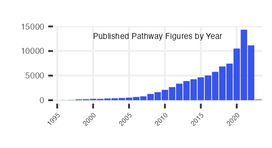

# PFOCR Stats

This R notebooks prepares counts and figures to summarize PFOCR
activity. The output files are displayed on the website and used in
publications and grant applications.

-   Data points are collected in \_*data/*
-   Plots are saved in *assets/img/*

## Read PFOCR .rds files

Set the path to these files

Read in files

``` r
figs <- readRDS(file.path(local.path,"pfocr_figures_draft.rds"))
genes <- readRDS(file.path(local.path,"pfocr_genes_draft.rds"))
chems <- readRDS(file.path(local.path,"pfocr_chemicals_draft.rds"))
dis <- readRDS(file.path(local.path,"pfocr_diseases_draft.rds"))
```

## Contents and counts

``` r
papers <- figs %>%
    distinct(pmcid)
papers_hs <- figs %>%
    dplyr::filter(grepl('Homo sapiens',organisms_ner)) %>%
    distinct(pmcid)
figures_hs <- figs %>%
    dplyr::filter(grepl('Homo sapiens',organisms_ner)) %>%
    distinct(figid)
ncbigenes <- genes %>%
    distinct(ncbigene_id)
ncbigenes_hs <- genes %>%
    dplyr::filter(organism_id == 9606) %>%
    distinct(ncbigene_id)
chemicals_mesh <- chems %>%
    distinct(mesh)
chemicals_chebi <- chems %>%
    distinct(chebi)
diseases_mesh <- dis %>%
    distinct(mesh)
diseases_doid <- dis %>%
    distinct(doid)
fig.num <- nrow(figs)
paper.num <- nrow(papers)
fig.hs.num <- nrow(figures_hs)
paper.hs.num <- nrow(papers_hs)
gene.total <- nrow(genes)
gene.unique <- paste(nrow(ncbigenes), "(ncbigene)")
gene.hs.unique <- paste(nrow(ncbigenes_hs), "(human)")
chem.total <- nrow(chems)
chem.unique.mesh <- paste(nrow(chemicals_mesh), "(mesh)")
chem.unique.chebi <- paste(nrow(chemicals_chebi), "(chebi)")
di.total <- nrow(dis)
di.unique.mesh <- paste(nrow(diseases_mesh), "(mesh)")
di.unique.doid <- paste(nrow(diseases_doid), "(doid)")

data <- data.frame(Total = c(gene.total,chem.total,di.total), Unique = c(gene.unique, chem.unique.mesh, di.unique.mesh), Specific = c(gene.hs.unique, chem.unique.chebi, di.unique.doid))
row.names(data) = c("Genes", "Chemicals", "Diseases")
```

The Pathway Figure OCR project has identified 110408 pathway figures
from 93057 published papers.

|           |     Total | Unique            | Specific      |
|:----------|----------:|:------------------|:--------------|
| Genes     | 4,687,583 | 147974 (ncbigene) | 18586 (human) |
| Chemicals |   346,094 | 14212 (mesh)      | 6785 (chebi)  |
| Diseases  |    44,598 | 1632 (mesh)       | 673 (doid)    |

Contents extracted from figures

## Main page plot

``` r
years.plot <- figs %>%
    dplyr::filter(!is.na(year)) %>%
      group_by(year) %>%
      dplyr::summarize(fig_cnt = n())

min.year = min(years.plot$year)
max.year = max(years.plot$year)
    
p <- years.plot %>%
      ggplot(aes(x=factor(year, levels = seq(min.year, max.year)), y=fig_cnt, 
                 fill = case_when(
                   year == max.year ~ "no",
                   year < max.year ~ "yes"
                 ))) +
      geom_bar(stat="identity") +
      ggtitle("Published Pathway Figures by Year") +
      xlab("") + 
      ylab("") +
      scale_x_discrete(breaks = factor(seq(min.year,max.year,by=5)), drop=FALSE)  +
      scale_fill_manual(values = c("yes" = "#3955E7", "no" = "#7995F7" ), guide = "none" ) + 
      theme(axis.text.x = element_text(angle = 45, hjust = 1, size = 4),
            axis.text.y = element_text(size = 5),
            text = element_text(size = 4, ,  family="Helvetica", face="plain"),
            panel.grid.major = element_line(color="#eeeeee"), 
            plot.title = element_text(hjust = 0.5,vjust = -15),
          panel.background = element_rect(fill='transparent'), #transparent panel bg
          plot.background = element_rect(fill='transparent', color=NA), #transparent plot bg
          panel.grid.minor = element_blank(), #remove minor gridlines
          legend.background = element_rect(fill='transparent'), #transparent legend bg
          legend.box.background = element_rect(fill='transparent') #transparent legend panel
      ) 

p
```


``` r
ggsave("../assets/img/pfocr_stats.png", plot = last_plot(), 
       width = 1100, height = 600, units = "px", dpi = 450, bg='transparent')
```



## Counts
