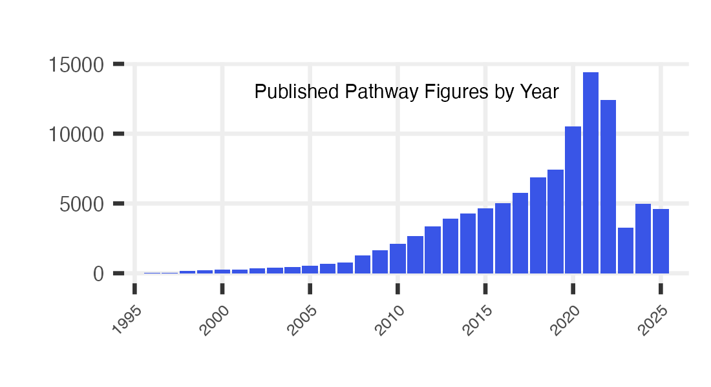

# PFOCR Stats

This R notebooks prepares counts and figures to summarize PFOCR
activity. The output files are displayed on the website and used in
publications and grant applications.

-   Data points are collected in \_*data/*
-   Plots are saved in *assets/img/*

## Read PFOCR .rds files

Set the path to these files

Read in files

``` r
figs <- readRDS(file.path(local.path,"pfocr_figures.rds"))
years <- readRDS(file.path(local.path,"pfocr_years.rds"))
genes <- readRDS(file.path(local.path,"pfocr_genes.rds"))
chems <- readRDS(file.path(local.path,"pfocr_chemicals.rds"))
dis <- readRDS(file.path(local.path,"pfocr_diseases.rds"))
```

## Main page plot

``` r
years.plot <- years %>%
      group_by(year) %>%
      summarize(fig_cnt = n())

min.year = min(years.plot$year)
max.year = max(years.plot$year)
    
years.plot %>%
      ggplot(aes(x=factor(year, levels = seq(min.year, max.year)), y=fig_cnt, 
                 fill = case_when(
                   year == max.year ~ "no",
                   year < max.year ~ "yes"
                 ))) +
      geom_bar(stat="identity") +
      ggtitle("Published Pathway Figures by Year") +
      xlab("") + 
      ylab("") +
      scale_x_discrete(breaks = factor(seq(min.year,max.year,by=5)), drop=FALSE)  +
      scale_fill_manual(values = c("yes" = "#3955E7", "no" = "#7995F7" ), guide = "none" ) + 
      theme(axis.text.x = element_text(angle = 45, hjust = 1, size = 4),
            axis.text.y = element_text(size = 5),
            text = element_text(size = 4, ,  family="Helvetica", face="plain"),
            panel.grid.major = element_line(color="#eeeeee"), 
            plot.title = element_text(hjust = 0.5,vjust = -15),
          panel.background = element_rect(fill='transparent'), #transparent panel bg
          plot.background = element_rect(fill='transparent', color=NA), #transparent plot bg
          panel.grid.minor = element_blank(), #remove minor gridlines
          legend.background = element_rect(fill='transparent'), #transparent legend bg
          legend.box.background = element_rect(fill='transparent') #transparent legend panel
      ) 
```


``` r
ggsave("../assets/img/pfocr_stats.png", plot = last_plot(), 
       width = 550, height = 300, units = "px", dpi = 250, bg='transparent')
```



## Counts
